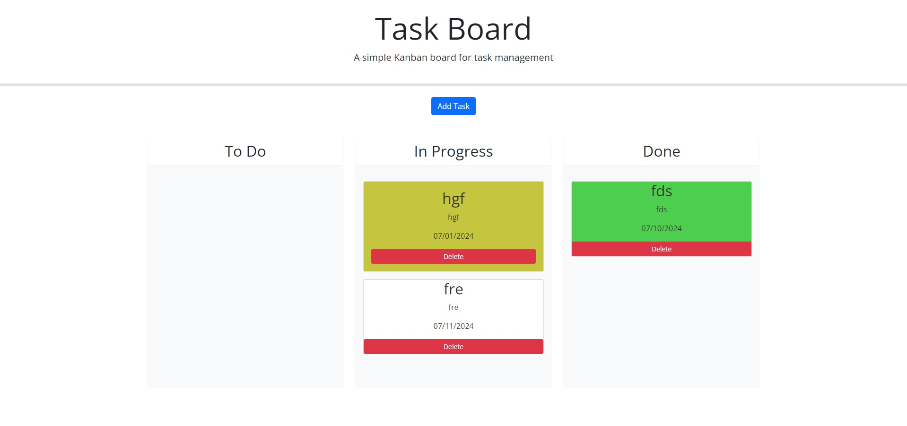

# Task Manager
## Description
This project was undertaken as part of a coding bootcamp. This was the fifth challenege for the bootcamp. The goal was to create a task manager using jqery and bootstrap. A modal should pop up and ask the user for the task title, task descript, and the due date. after adding the task a card with theuser input pops up in the todo column. The card color changes based on the due date of the task. white if in the future, yellow if same day and red if past the date. The user can drag and drop the cards into the three different catagories. Finally each card has a delete button that removes the task.

## Installation
If you wish to run this project locally on your own computer, assuming you have git installed, input the following code in your terminal.
git clone https://github.com/philcurtis4/task_manager_5
## Usage
The live site may be viewed at the following url.
https://philcurtis4.github.io/task_manager_5/
Here is a screenshot of the page.

    
## Credits
Created by Rutgers bootcamp as well as Philip Curtis
## License
This project has a MIT License. For more information read the LICENSE file.
---